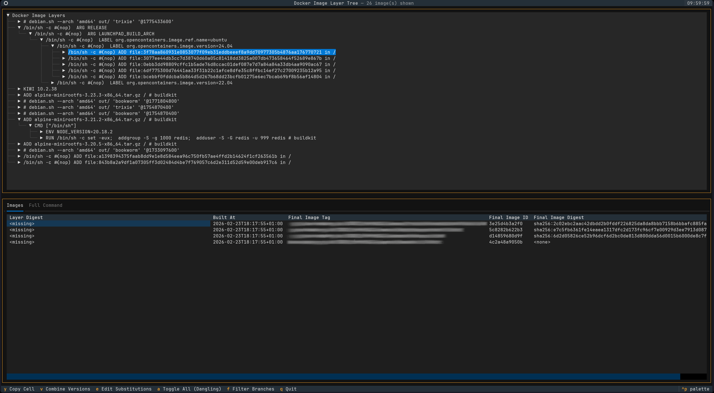

# DILT: Docker image layer Tree

DILT is a tool for visualizing the layers of all local Docker images as a combined tree structure. This allows you to quickly identify similar images, parent images, and older (dangling) versions of an image.



Images can be positioned within the tree based on the commands that created them or by their specific digests. Substitution (either manual or via the predefined _Combine Versions_) allows you to merge similar layers into a single tree node.

# Basic Usage

```bash
pip install -r requirements.txt
python3 dilt.py
```

The recommended way of navigating the tree is by using Vim bindings (h,j,k,l).
You can also use H and L to quickly collapse the entire branch or expand to it to the next node with multiple children.

All keybindings are listed in the Keys section, which can be found under the command palette (Ctrl+P).


# Contributing
Contributions are welcome!

This project accepts AI-generated code, provided that the code has been manually reviewed and verified by a human.

# Alternatives

For a non interactive cli version, instead of a tui, you might want to check out [dockviz](https://github.com/justone/dockviz) (Not related to this project)

# Disclaimer

This project is not affiliated with Docker.

As this is a relatively straightforward tool, it was written with significant assistance from AI to ensure a rapid development process.
Still, this project is in its early stages.
